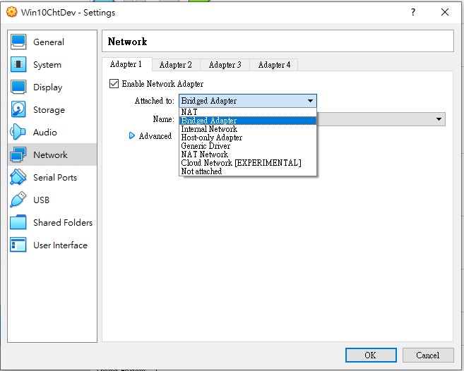
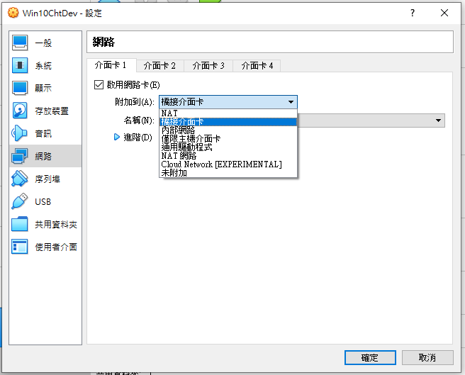
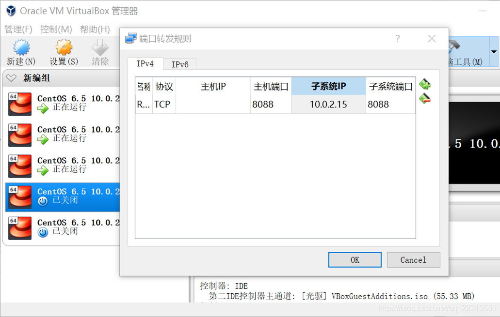
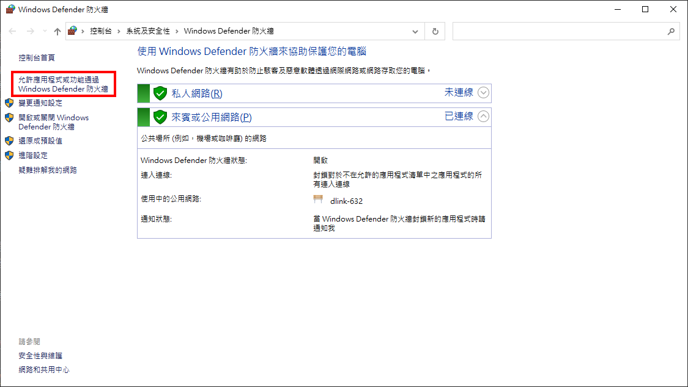
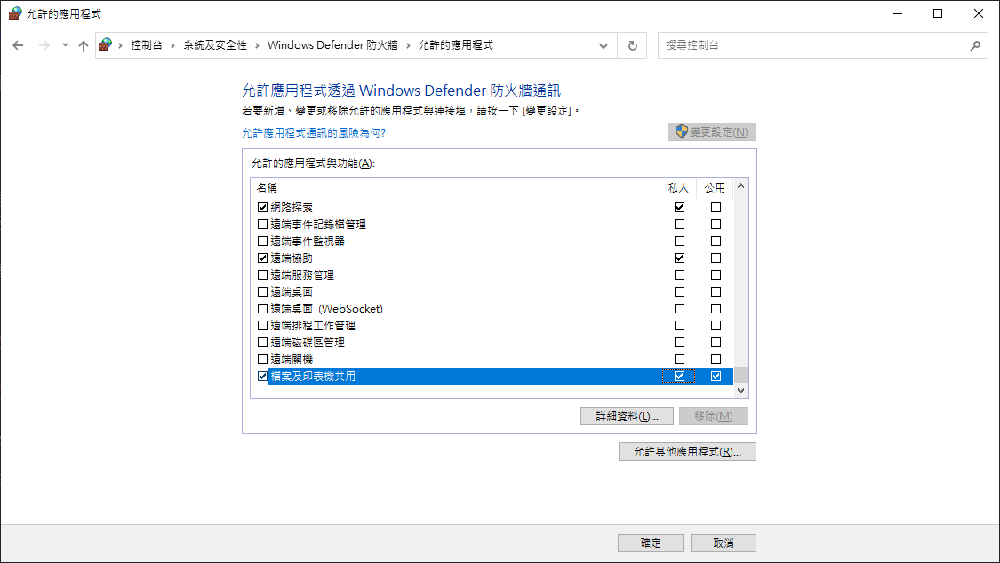
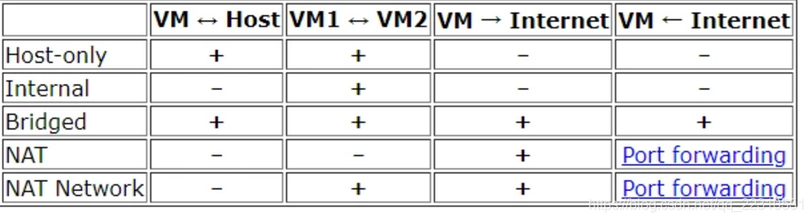
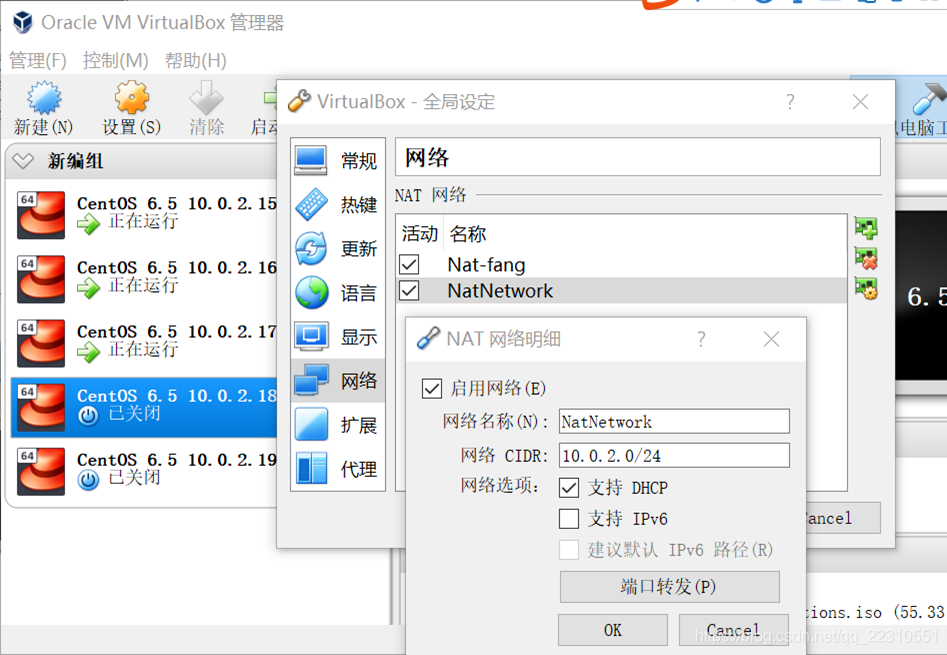
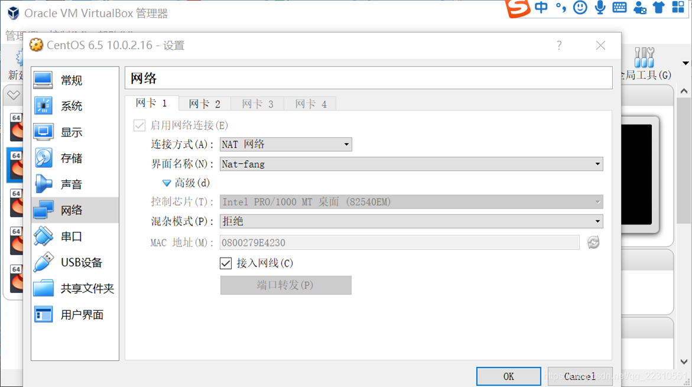
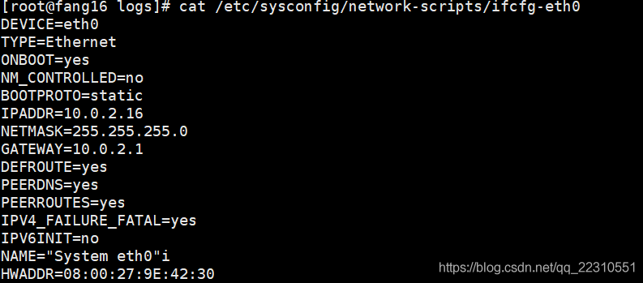

Viutual Box 網路連線方式
===

  

  

|             | NAT | Bridged Adapter | Internal | Host-only Adapter |
|-------------|:---:|:-----------------:|:----------:|:-------------------:|
| 虛擬機 => 主機   | v   | v               | x        | 預設不能需設置           |
| 主機 => 虛擬機   | x   | v               | x        | 預設不能需設置           |
| 虛擬機 => 其他主機 | v   | v               | x        | 預設不能需設置           |
| 其他主機 => 虛擬機 | x   | v               | x        | 預設不能需設置           |
| 虛擬機之間       | x   | v               | 同網路名下可以  | v                 |

# NAT 模式：可以連線網際網路

- 特點：

1. 如果主機可以上網，虛擬機器可以上網
1. 虛擬機器之間不能 ping 通
1. 虛擬機器可以 ping 通主機（此時 ping 虛擬機器的閘道器，即是 ping 主機）
1. 主機不能 ping 通虛擬機器

- 應用場景：虛擬機器只要求可以上網，無其它特殊要求，滿足最一般需求

## NAT 模式 + 埠對映

將虛擬機器某埠對映到主機某埠。如下圖，windows 下的瀏覽器訪問 127.0.0.1:8088 實際訪問的是 10.0.2.15:8088。

  

# Bridged Adapter 模式（橋接模式）：地位等同於本機的虛擬機器

- 特點：

1. 如果主機可以上網，虛擬機器可以上網
1. 虛擬機器之間可以 ping 通
1. 虛擬機器可以 ping 通主機
1. 主機可以 ping 通虛擬機器
1. 以上各點基於一個前提：主機可以上網，如果主機不可以上網，所有 1-4 特點均無

- 應用場景：虛擬機器要求可以上網，且虛擬機器完全模擬一臺實體機
- ip 樣式：ip 與本機 ip 在同一網段內，閘道器與本機閘道器相同

# Internal 模式（內部網路模式）

- 特點：

1. 虛擬機器不可以上網
1. 虛擬機器之間可以 ping 通
1. 虛擬機器不能 ping 通主機
1. 主機不能 ping 通虛擬機器

- 應用場景：讓各臺虛擬機器處於隔離的區域網內，只讓它們相互通訊，與外界（包括主機）隔絕

# Host-only Adapter 模式(僅限主機介面卡)：一個網絡卡下的區域網，閘道器為 Host-Only IP

- 特點：

1. 虛擬機器不可以上網
1. 虛擬機器之間可以 ping 通
1. 虛擬機器可以 ping 通網絡卡 IP，但不能 ping 通本機自己的 IP（注意虛擬機器與主機通訊是通過主機的名為 VirtualBox Host-Only Network 的網絡卡，因此 ip 是該網絡卡 ip 192.168.56.1，而不是你現在正在上網所用的 ip）
1. 主機可以 ping 通虛擬機器
1. 如果 ping 不通網絡卡 IP，是因為 windows 開了防火牆。參考修改防火牆：

> 今天配環境發現 VMware 下的虛擬機器：host-only 模式，主機能 ping 通虛擬機器，虛擬機器無法 ping 通主機
> 解決辦法:
> 1. 打開`控制台` => `Windows 防火牆`
> 
> 2. 點擊最上面的 `允許應用程式或功能通過 Windows Defender 防火牆`
> 
>   
> 
> 3. 勾上下圖的 `檔案和印表機共用` 然後點確定。
> 
>   
> 
> 再從虛擬機器ping 主機 問題解決！

- 應用場景：在主機無法上網的情況下（主機可以上網的情況下可以用 host-only，也可以用橋接），需要搭建一個模擬區域網，所有機器可以互訪。

# Generic networking (通用驅動程式)

- 用於選擇網卡驅動。該驅動，是 virtualbox 內部自帶的，或者是通過 extension pack 添加進來的
- 通常用於 UDP Tunnel 、VDE (Virtual Distributed Ethernet) networking

# NAT 網路：Virtual Box 自動生成 .1 閘道器。相當於一個網絡卡下的區域網

- VirtualBox 4.3 才開始引入的 NAT 進階方式，特點如 NAT

- 網路地址轉換（NAT）和 NAT 網路區別

網路地址轉換（NAT）和 NAT 網路原理相同，但是 NAT 網路提前配置，配置好之後，選擇同一個 NAT 網路的虛擬機器相當於在一個區域網下，互相之間是可以 ping 通的。如下圖所示，+ 代表可以，- 代表不可以。Port forwarding 代表埠對映。

由圖可知，網路地址轉換和 NAT 網路區別在於虛擬機器之間是否可以互 ping。

  

- 配置方法

第一步：管理---全域性設定---網路，右側 + 新建一個 NAT 網路。網路 CIDR 是無類域間路由，確定了此網路的子網掩碼（NETMASK）是 255.255.255.0。

  

第二步、在每個虛擬機器上右鍵---設定---網路連線方式選擇 NAT 網路，介面名稱選擇剛才定義的 NAT 網路名。如果多個虛擬機器選擇都是一個 NAT 網路，那麼這幾個虛擬機器相當於在一個區域網下。10.0.2.1 Virtual Box 會預設生成，作為此區域網的閘道器（GATEWAY）。只要自己給每個虛擬機器定義一個靜態 IP 即可。

  

第三步、修改虛擬機器配置檔案，指定靜態 IP。HWADDR 為上圖中的 MAC 地址。

  

# Not Attached(未附加)

會在 Guest 環境中出現一張網卡，但是就像沒有插網路線一樣. 這和未勾選 "啟用網路卡" 不同，沒有啟用網路卡時，就好像在電腦上沒有安裝網卡，而 未掛附是指未接網路線，在測試程式時，各軟體的執行行為些差異。

[註]：
Guest：指的就是 VirtualBox 的虛擬機器

###### 資料來源

- [徹底理解Viutual Box四種網路連線方式 - 程式人生](https://www.796t.com/content/1546159202.html)
- [在 VirtualBox 中的網路卡模式設定 @ 風影淚的部落格 :: 痞客邦 ::](https://kimkicho.pixnet.net/blog/post/230281147-%E5%9C%A8-virtualbox-%E4%B8%AD%E7%9A%84%E7%B6%B2%E8%B7%AF%E5%8D%A1%E6%A8%A1%E5%BC%8F%E8%A8%AD%E5%AE%9A)
- [\[Tool\] VirtualBox 網路卡種類](https://zwindr.blogspot.com/2016/11/tool-virtualbox.html)